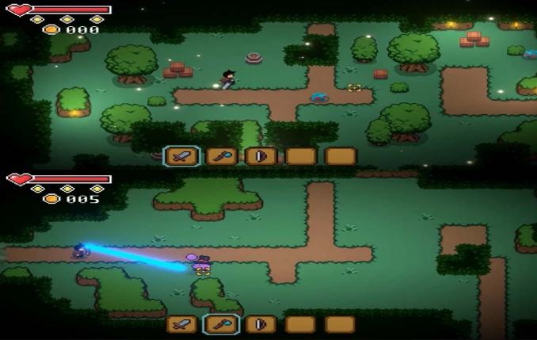

# mini-arcade-game-syaugi

**"Jungle Mayhem"** is a thrilling arcade-style game where players embody a brave knight navigating treacherous terrain and battling fierce foes in a vibrant 2D top-down jungle. Unravel the mysteries of ancient ruins, confront mythical creatures, and embark on an epic quest filled with adrenaline-pumping action and captivating discovery.

## Project Overview
This mini arcade game was made for educational purposes, and all the sprites and scripts are not for commercial use. This project is meant to showcase my skills in game development and script writing. The project is currently in the script writing (scenarios) phase, with the next steps being scripting (story flows) and sprite addition/renewal.

## Features
- **Epic Quests**: Embark on a journey through ancient ruins and mystical landscapes.
- **Fierce Battles**: Engage in combat with mythical creatures and other formidable foes.
- **Vibrant 2D Graphics**: Enjoy a visually captivating jungle environment with detailed sprites and animations.

## My Role
- **Script Writer**
- **Game Developer**

## Tech I've Used
- **Unity**
- **C#**

## Current Progress
- **Script Writing (Scenarios)**: Crafting the game's storyline and dialogues.
- **Next Steps**: Developing the story flows and enhancing/adding sprites.
